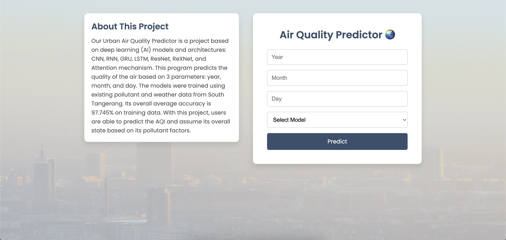
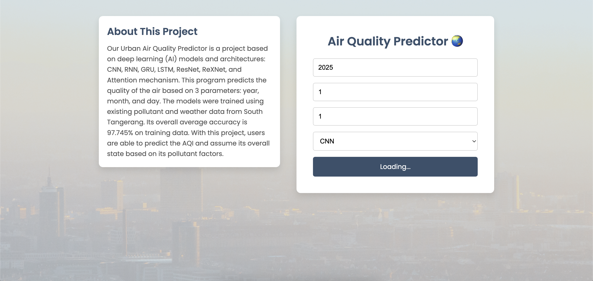
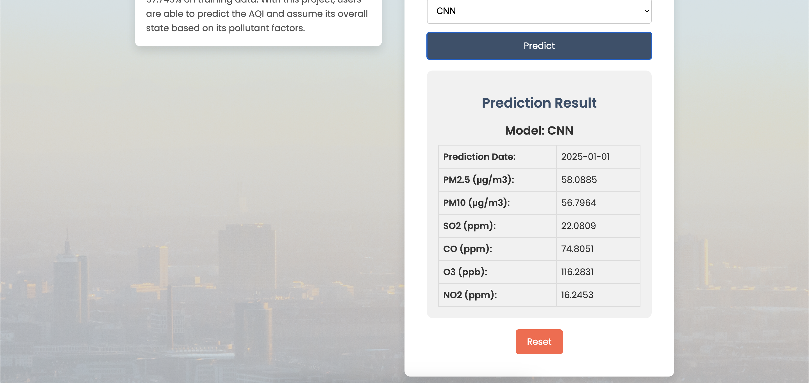

# Urban Air Quality Predictor in Indonesia using Deep Learning Based on Pollution Data

Our Urban Air Quality Predictor is a project based on deep learning (AI) models and architectures: CNN, RNN, GRU, LSTM, ResNet, ReXNet, and Attention mechanism. This program predicts the quality of the air based on 3 parameters: year, month, and day. The models were trained using existing pollutant and weather data from South Tangerang. Its overall average accuracy is 97.745% on training data. With this project, users are able to predict the AQI and assume its overall state based on its pollutant factors.

---

## 🌟 Features
- Interactive and user-friendly interface for inputting prediction parameters (year, month, day, and model).
- Visualizes air quality predictions for metrics like PM2.5, PM10, CO, O3, SO2, and NO2.
- Supports multiple models:
  - CNN
  - RNN
  - GRU
  - LSTM
  - ResNet
  - ReXNet
  - Variants with Attention Mechanism.
- Real-time integration with the backend for accurate predictions.

## 🚀 Technology Stack
- **Frontend**: React.js, Axios, Chart.js, CSS for styling.
- **Backend**: Flask API (integrated with deep learning models).
- **Deployment**: Hosted on Vercel for fast and global accessibility.

## ⚙️ Installation and Setup
1. **Clone the Repository**  
   ```bash
   git clone https://github.com/brishar0n/AirQualityPred-Frontend.git
   cd AirQualityPred-Frontend
   ```

2. **Install Dependencies**
   ```
   npm install
   ```
   
3. **Run Locally**
   ```
   npm run dev
   ```
   Open http://localhost:5173 in your browser to view the app or open [this Vercel link](https://air-quality-pred-frontend.vercel.app)

## 🛠 Project Structure

```
AirQualityPred-Frontend/
├── public/                  # Static files and assets
├── src/
│   ├── components/          # Reusable React components
│   ├── styles/              # CSS files for styling
│   ├── App.js               # Main application logic
│   └── index.js             # Application entry point
├── package.json             # Project dependencies and scripts
├── README.md                
└── .gitignore               
```

## 🖼 App Interface




## 🤝 Contributors
- [Ari Jaya Teguh](https://github.com/Spacebone31)
- [Brigitte Sharon Alexander](https://github.com/brishar0n)
- [Ivandito Rakaputra](https://github.com/IvanditoRakaputra)

## 📄 License
This project is licensed under the MIT License.
Feel free to use, modify, and distribute this software for personal or commercial purposes.
